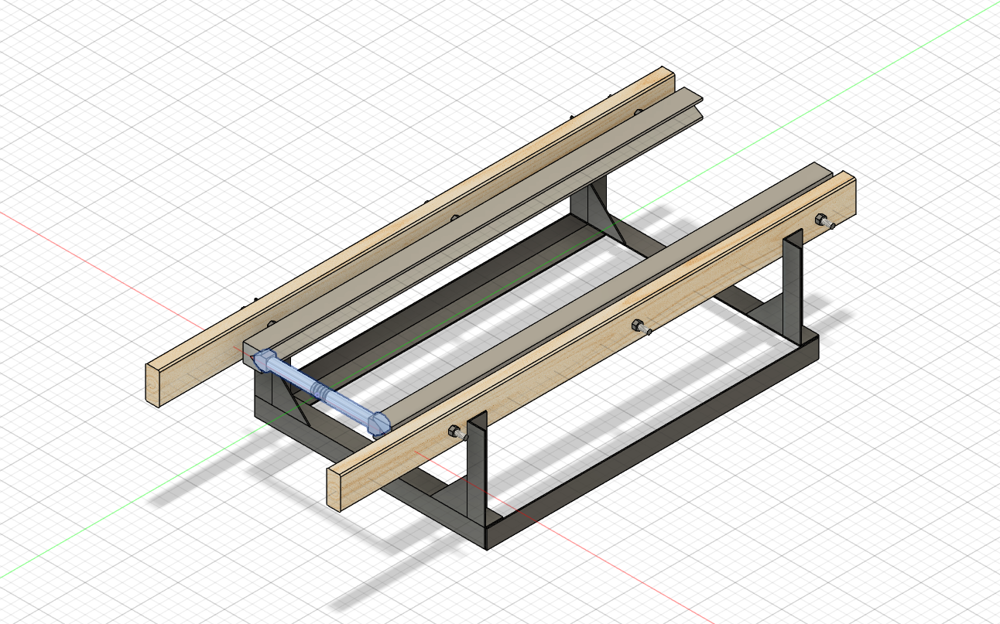
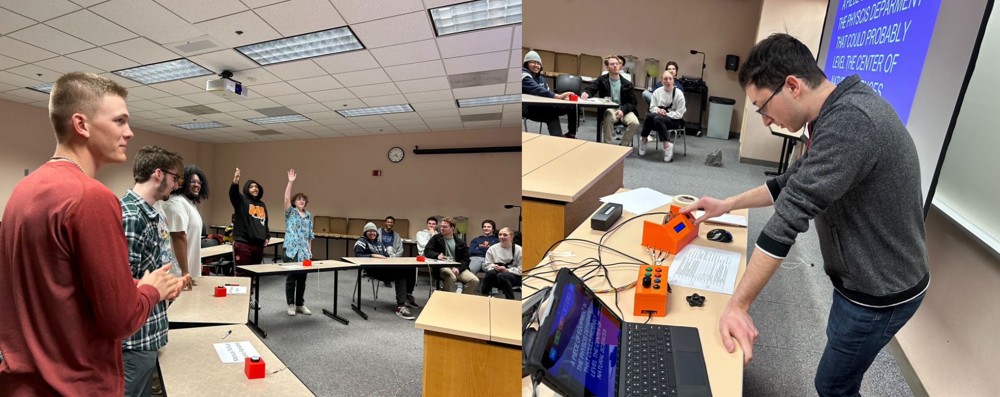
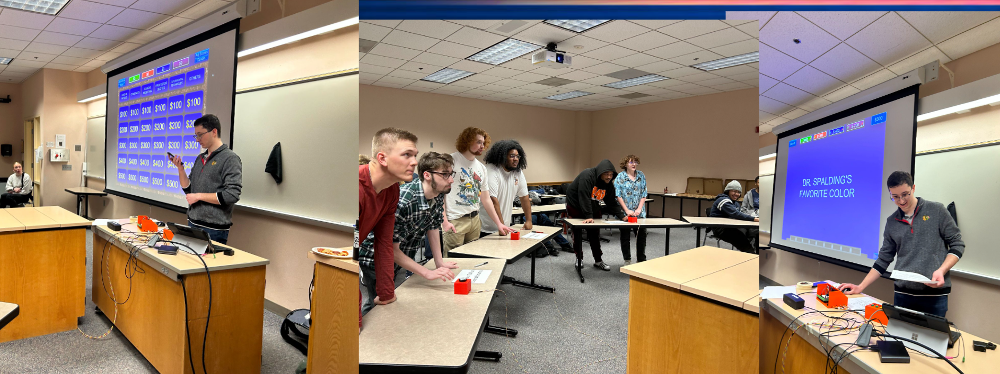

### Member (SP21)
Once I joined the club, the current president and vice-president host work session working to create timing gates using diodes and photo-resistors, which I joined in designing CAD models to hold the sensors and learning to solder and tinker with electronics. This is where my passion for electronics started.

### Vice-President (FL21-SP22)
When I became vice-President, I worked with the president to design a mathematical model of a magnetically propelled pumpkin launcher (This code was not properly shared and had been lost). This was design using Mathematica. This project was chosen for the draw in physics community members to build something practical with their knowledge of electricity and magnetism and to do something fun. This was done with collaboration with the sitting student chapter president. The model showed that an external plate magnet of neodymium magnets was required with 

### President (FL22-FL23)
Once I became president, I took over the design of the magnetically propelled pumpkin launcher, moving towards the electrical aspects of the system and an initial physics design using Fusion 360. I organized hosting meeting and events, managing communications and finances. Due to the sting of academic life and other responsibilities, I was trying to manage a student organization without much help. I was able to organize and host meeting and workshops, such as design meetings, soldering workshops, and machine shop training for interested students. I worked to create the good post-pandemic community of interested physicists to continue the project and engage with other members of the department.

#### Magnetically Propelled Pumpkin Launcher

Once the model was complete I worked to create CAD models for a prototype form factor seen in the image below. This prompted my to plan workshops to teach everyone interested, how to solder and perform basic machining operations. This was done with the help of faculty and staff and Illinois Wesleyan, offering to teach their skills and expertise to interested students. The basic design and idea was completed by interested members and myself, having ideas on how to design a high current capacitor bank, calculating the current needed to launch the launcher certain distances, and hosting design competitions for how the pumpkin was to be mounted on the carriage. My leadership had this focus to make this happen, but with a concentration in teaching members skills that would last beyond their time in university.

#### Events
I also coordinated and hosted a pair of events entitled the _Physics Picnic_ and _Physics Phun Night_. The _Physics Picnic_ is an event hosted by the physics department in the Fall to facilitate new students in the department to engage with upperclassman, getting to know them and playing fun games together. I was responsible for purchasing the food and drinks, as well as preparing the food during the event. I also co-hosted the _Physics Phun Night_ event, which this year was _Physics Jeopardy Night_ where me and a classmate, Nathan Killough, designed the questions and answers for the event, as to allow as many other classmates to participate. For the immersion of the event, I designed my own set of buzzers, buying a set of large arcade buttons, 3D printing enclosure, and programming in Arduino C++ for the first time. I had designed the buzzer system with sound effects on an Arduino Mega. And yes you read that correctly, I added sound effects that I could play based on participants answers, these systems were run on two different arduino's, which was a difficult task for a first time coder. The system also had a display to let me know which contestant had buzzed in and when the system was active. Due to unforeseen circumstances, I ended up running the event on my own which was stressful but extremely fun. The [buzzer](../code/Buzzer2.ino) and [soundboard](../code/AudioDrive.ino) code can be found by clicking on the corresponding keyword (this code is not great for an experienced coder, but was a challenge for a first time coder and has not been updated since).

The Jeopardy game itself was designed from a powerpoint template found online with every question made or selected by me or my partner in crime. For the Final Jeopardy, contestants were tasked with designing and constructing a parachute from simple office materials and have it take the longest to reach the ground. The event ended up being a rounding success with almost everyone leaving with a smile on their face, with a the department chair commenting that he hadn't seen so many people naturally smiling for a picture.  

